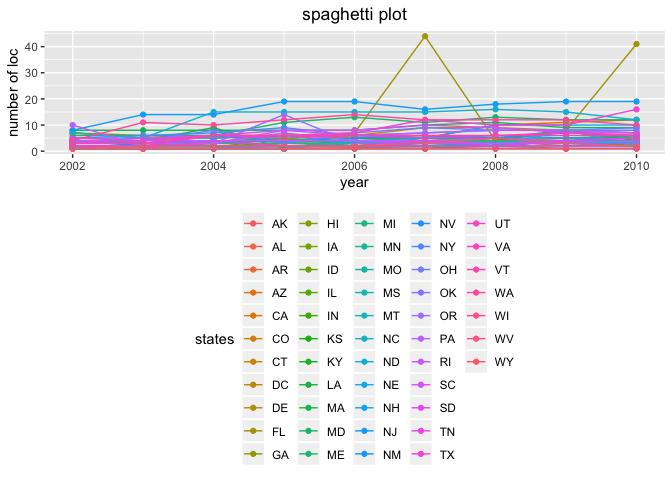
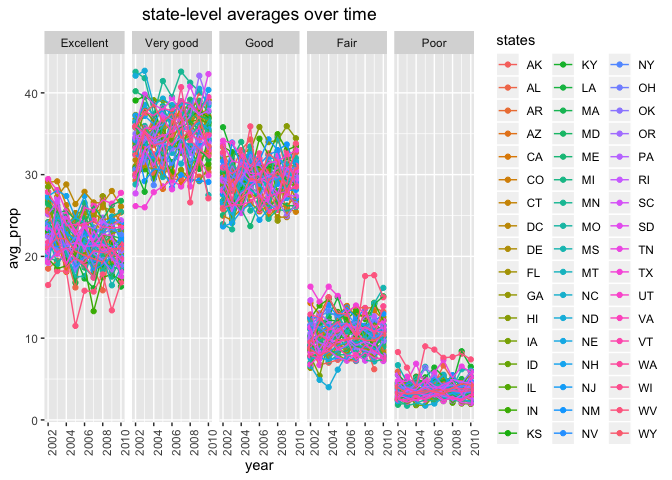
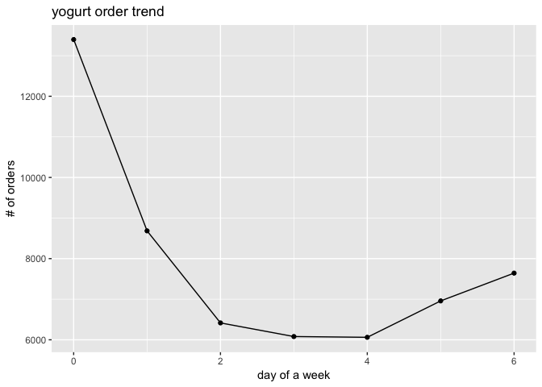
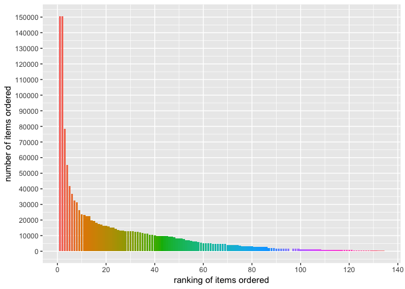

p8105\_hw3\_jz3036
================
Junyuan Zheng (jz3036)
2018-10-10

-   Import necessary packages.

``` r
library(tidyverse)
```

    ## ── Attaching packages ─────────────────────────────────────────────────────────── tidyverse 1.2.1 ──

    ## ✔ ggplot2 3.0.0     ✔ purrr   0.2.5
    ## ✔ tibble  1.4.2     ✔ dplyr   0.7.6
    ## ✔ tidyr   0.8.1     ✔ stringr 1.3.1
    ## ✔ readr   1.1.1     ✔ forcats 0.3.0

    ## ── Conflicts ────────────────────────────────────────────────────────────── tidyverse_conflicts() ──
    ## ✖ dplyr::filter() masks stats::filter()
    ## ✖ dplyr::lag()    masks stats::lag()

``` r
#library(readxl)
```

Problem 1
=========

-   Import the raw data for Problem 1.

``` r
library(p8105.datasets)
data(brfss_smart2010)
```

-   Data manipulation:

``` r
data_p1 = 
  janitor::clean_names(brfss_smart2010) %>%
  filter(., topic == 'Overall Health') %>%
  filter(., response == 'Poor' | response == 'Fair' | response == 'Good' | response == 'Very good' | response == 'Excellent') %>%
  mutate(., response = factor(response, levels = str_c(c("Excellent", "Very good", "Good", "Fair", "Poor"))))
```

-   Q1 In 2002, which states were observed at 7 locations?

``` r
data_p1_q1 = 
  filter(data_p1, year == '2002') %>% 
  group_by(., locationabbr) %>% 
  summarize(., n_loc = n_distinct(locationdesc)) %>% 
  filter(., n_loc == 7)
data_p1_q1
```

    ## # A tibble: 3 x 2
    ##   locationabbr n_loc
    ##   <chr>        <int>
    ## 1 CT               7
    ## 2 FL               7
    ## 3 NC               7

CT, FL, and NC were observed at 7 locations.

-   Q2 Make a “spaghetti plot” that shows the number of locations in each state from 2002 to 2010.

``` r
data_p1 %>% 
  group_by(., year, locationabbr) %>% 
  summarize(., n_loc = n_distinct(locationdesc)) %>% 
  ggplot(aes(x = year, y = n_loc, color = locationabbr)) +
    geom_point() + geom_line() + 
    theme(legend.position = "bottom", plot.title = element_text(hjust = 0.5)) +
    labs(y = 'number of loc', color = 'states', title = 'spaghetti plot')
```



-   Q3 Make a table showing, for the years 2002, 2006, and 2010, the mean and standard deviation of the proportion of “Excellent” responses across locations in NY State.

``` r
data_p1 %>%
  filter(., year=='2002' | year=='2006' | year=='2010', response=='Excellent') %>% 
  group_by(., year) %>% 
  summarize(., mean = mean(data_value, na.rm = TRUE), SD = sd(data_value, na.rm = TRUE))
```

    ## # A tibble: 3 x 3
    ##    year  mean    SD
    ##   <int> <dbl> <dbl>
    ## 1  2002  24.0  4.64
    ## 2  2006  22.4  4.10
    ## 3  2010  21.5  4.25

-   Q4 For each year and state, compute the average proportion in each response category (taking the average across locations in a state).

``` r
data_p1_q4_1 = 
  group_by(data_p1, year, locationabbr) %>% 
  summarize(., n_loc = n_distinct(locationdesc))

data_p1_q4_2 =
  group_by(data_p1, year, locationabbr, response) %>%
  summarize(., mean_sum = sum(data_value))

data_p1_q4 = left_join(data_p1_q4_2, data_p1_q4_1, by = c('year'='year', 'locationabbr'='locationabbr'))

data_p1_q4 = mutate(data_p1_q4, avg_prop = mean_sum/n_loc)
head(data_p1_q4)
```

    ## # A tibble: 6 x 6
    ## # Groups:   year, locationabbr [2]
    ##    year locationabbr response  mean_sum n_loc avg_prop
    ##   <int> <chr>        <fct>        <dbl> <int>    <dbl>
    ## 1  2002 AK           Excellent     27.9     1     27.9
    ## 2  2002 AK           Very good     33.7     1     33.7
    ## 3  2002 AK           Good          23.8     1     23.8
    ## 4  2002 AK           Fair           8.6     1      8.6
    ## 5  2002 AK           Poor           5.9     1      5.9
    ## 6  2002 AL           Excellent     18.5     1     18.5

-   Make a five-panel plot that shows, for each response category separately, the distribution of these state-level averages over time.

``` r
ggplot(data_p1_q4, aes(x = year, y = avg_prop, color = locationabbr)) +
    geom_point() + geom_line() +
    facet_grid(. ~ response) +
    theme(legend.position = "right", plot.title = element_text(hjust = 0.5),
          axis.text.x = element_text(angle=90)) +
    labs(y = 'avg_prop', color = 'states', title = 'state-level averages over time')
```

    ## Warning: Removed 21 rows containing missing values (geom_point).

    ## Warning: Removed 1 rows containing missing values (geom_path).



Problem 2
=========

-   Import the raw data for Problem 2.

``` r
library(p8105.datasets)
data(instacart)
data_p2 = instacart
```

-   write a short description of the dataset, noting the size and structure of the data, describing some key variables, and giving illstrative examples of observations.

-   This is a subset of a dataset containing online purchase information for each order. The dataset we are using contains 1384617 rows or purchase of goods, and 15 variables for each purchase.
-   The variables can be roughly separated into three parts: cumtomer info, goods info, and time info. Variables that could potientially provides useful infomation include the reordered info, order time of the week and the day, and the aisle info.
-   For example, the plot below told us people tend to order yogurt on Sunday more, less on the middle of the week.

``` r
data_p2 %>%
  filter(., aisle == 'yogurt') %>% 
  group_by(., order_dow) %>% 
  summarize(., n = n()) %>% 
  ggplot(., aes(x = order_dow, y = n)) +
    geom_point() + geom_line() +
    labs(y = '# of orders', x = 'day of a week', title = 'yogurt order trend')
```



-   Q1 How many aisles are there, and which aisles are the most items ordered from?

``` r
data_p2_q1 =
  group_by(data_p2, aisle) %>%
  summarize(., n = n()) %>% 
  mutate(aisle_ranking = min_rank(desc(n)))

nrow(data_p2_q1)
```

    ## [1] 134

``` r
filter(data_p2_q1, aisle_ranking == 1)
```

    ## # A tibble: 1 x 3
    ##   aisle                 n aisle_ranking
    ##   <chr>             <int>         <int>
    ## 1 fresh vegetables 150609             1

There are 134 different aisles there, in which fresh vegetables are the aisle most ordered from.

-   Q2 Make a plot that shows the number of items ordered in each aisle. Order aisles sensibly, and organize your plot so others can read it.

``` r
data_p2_q1 = arrange(data_p2_q1, desc(n))
ggplot(data=data_p2_q1, aes(x=aisle_ranking, y=n, fill = factor(aisle, levels = aisle))) +
  geom_bar(stat="identity", position = "dodge") +
  scale_x_continuous(breaks = seq(0, 140, by = 20)) +
  scale_y_continuous(breaks = seq(0, 150000, by = 10000)) +
  labs(y = 'number of items ordered', x = 'ranking of items ordered', fill = 'aisles') +
  theme(legend.position = "none", legend.key.size = unit(0.01, 'line'))
```

 The legend that is mean to guide finding corresponding aisle is too large, so I didn't print it out here. Also, the 95th and 96th ranking was tied, so there is a adding up on the plot.

-   Q3 Make a table showing the most popular item in each of the aisles “baking ingredients”, “dog food care”, and “packaged vegetables fruits”.

``` r
data_p2_q3 =
  filter(data_p2, aisle == 'baking ingredients' | aisle == 'dog food care' | aisle == 'packaged vegetables fruits') %>% 
  group_by(., aisle, product_name) %>% 
  summarize(n = n()) %>% 
  mutate(ranking = min_rank(desc(n))) %>% 
  filter(., ranking == 1) %>% 
  select(., aisle, product_name)
data_p2_q3
```

    ## # A tibble: 3 x 2
    ## # Groups:   aisle [3]
    ##   aisle                      product_name                                 
    ##   <chr>                      <chr>                                        
    ## 1 baking ingredients         Light Brown Sugar                            
    ## 2 dog food care              Snack Sticks Chicken & Rice Recipe Dog Treats
    ## 3 packaged vegetables fruits Organic Baby Spinach

-   Q4 Make a table showing the mean hour of the day at which Pink Lady Apples and Coffee Ice Cream are ordered on each day of the week; format this table for human readers (i.e. produce a 2 x 8 table).

``` r
data_p2_q4 = 
  filter(data_p2, product_name == 'Pink Lady Apples' | product_name == 'Coffee Ice Cream') %>% 
  group_by(., product_name, order_dow) %>% 
  summarize(., mean_hour = mean(order_hour_of_day)) %>% 
  spread(., key = order_dow, value = mean_hour)
data_p2_q4  
```

    ## # A tibble: 2 x 8
    ## # Groups:   product_name [2]
    ##   product_name       `0`   `1`   `2`   `3`   `4`   `5`   `6`
    ##   <chr>            <dbl> <dbl> <dbl> <dbl> <dbl> <dbl> <dbl>
    ## 1 Coffee Ice Cream  13.8  14.3  15.4  15.3  15.2  12.3  13.8
    ## 2 Pink Lady Apples  13.4  11.4  11.7  14.2  11.6  12.8  11.9

Problem 3
=========

-   Import the raw data for Problem 3.

``` r
library(p8105.datasets)
data(ny_noaa)
data_p3 = ny_noaa
```

-   write a short description of the dataset, noting the size and structure of the data, describing some key variables, and indicating the extent to which missing data is an issue.

-   This dataset contains data from weather stations located at NYC region. It contains 2595176 rows or observations, and 7 variables for each observation.
-   Important variables include Precipatation, Snowfall, Snow depth, max and min temperature.
-   A lot of the observation in this dataset have missing value, which could be annoying since a lot of the time when we try to dig info from our data, we need all the variables to be available in each observation. One single missing value could make the one observation useless.

-   Q1-1 Do some data cleaning. Create separate variables for year, month, and day. Ensure observations for temperature, precipitation, and snowfall are given in reasonable units.

``` r
data_p3 = 
  separate(data_p3, date, into = c("year", "month", "day"), sep = "-")
data_p3$tmax = as.integer(data_p3$tmax) 
data_p3$tmin = as.integer(data_p3$tmin)

data_p3 = rename(data_p3, prcp_tenths_of_mm = prcp, snow_mm = snow, snwd_mm = snwd,
       tmax_tenths_of_degrees_C = tmax, tmin_tenths_of_degrees_C = tmin)

head(data_p3)
```

    ## # A tibble: 6 x 9
    ##   id    year  month day   prcp_tenths_of_… snow_mm snwd_mm tmax_tenths_of_…
    ##   <chr> <chr> <chr> <chr>            <int>   <int>   <int>            <int>
    ## 1 US1N… 2007  11    01                  NA      NA      NA               NA
    ## 2 US1N… 2007  11    02                  NA      NA      NA               NA
    ## 3 US1N… 2007  11    03                  NA      NA      NA               NA
    ## 4 US1N… 2007  11    04                  NA      NA      NA               NA
    ## 5 US1N… 2007  11    05                  NA      NA      NA               NA
    ## 6 US1N… 2007  11    06                  NA      NA      NA               NA
    ## # ... with 1 more variable: tmin_tenths_of_degrees_C <int>

-   Q1-2 For snowfall, what are the most commonly observed values? Why?

``` r
data_p3 %>%
  group_by(., snow_mm) %>% 
  summarize(., n = n()) %>% 
  mutate(., ranking = min_rank(desc(n))) %>% 
  filter(., ranking == 1)
```

    ## # A tibble: 1 x 3
    ##   snow_mm       n ranking
    ##     <int>   <int>   <int>
    ## 1       0 2008508       1

-   the most commonly observed snowfall value is 0, because no snowing is more common than snowing.

-   Q2 Make a two-panel plot showing the average max temperature in January and in July in each station across years. Is there any observable / interpretable structure? Any outliers?
